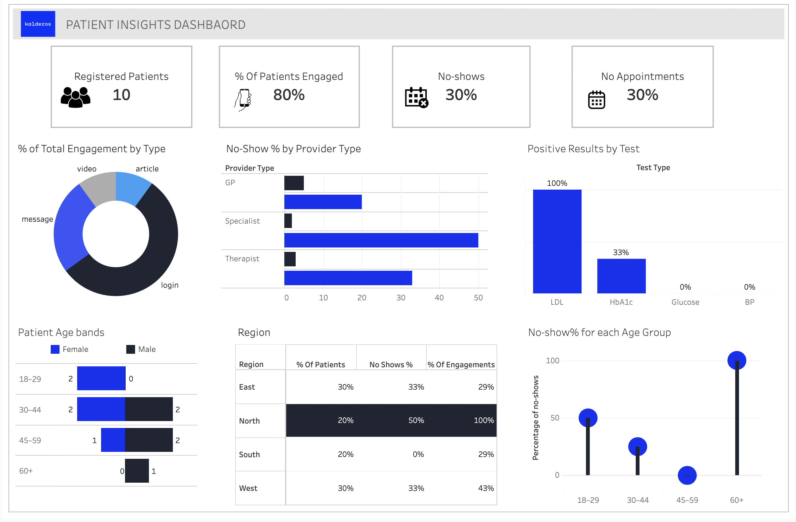

# 🏥 Healthcare Analytics Project

**Goal:** Improve patient engagement and reduce appointment no-shows using data-driven insights and predictive modeling.

---

## 📖 Overview

This project explores patient engagement data for a healthcare platform to identify patterns behind missed appointments and to design actionable interventions.  
It integrates **SQL**, **Python**, and **Tableau** for data exploration, visualization, and insight generation.

The work includes:
- Database schema design (ER diagram)
- Exploratory SQL analytics
- Engagement and demographic segmentation
- Predictive modeling using Python
- Interactive Tableau dashboard

---

## 🧠 Data Model

The dataset consists of four key entities — **Patients**, **Appointments**, **Engagements**, and **Lab Results**.

### Entity-Relationship Diagram

📄 [View ER Diagram (PDF)](reports/ER_diagram.pdf)

**Highlights:**
- `patients` table contains demographics and signup data  
- `appointments` tracks scheduled visits and attendance  
- `engagements` records digital actions (logins, messages, etc.)  
- `lab_results` includes diagnostic test outcomes (HbA1c, LDL, BP, Glucose)

---

## 📊 Dashboard & Reports

### Tableau Dashboard

  

🔗 **[View Live Tableau Dashboard](https://public.tableau.com/app/profile/sai.madhuri.kandula4056/viz/patient_dashabord/Dashboard1)**

---

### Supporting Reports & Files

| File | Description |
|------|--------------|
| 📄 [Insights & Recommendations (PDF)](reports/Insights%20&%20Recommendations_kalderos.pdf) | Strategic insights and action plan |
| 📊 [Kalderos Data Presentation (PPTX)](reports/kalderos-data-ppt.pptx) | Executive summary slides |
| 🧮 [Patient Queries (SQL)](reports/patient_queries_sql.txt) | SQL scripts for engagement and no-show analysis |
| 🤖 [ML Model (Notebook)](notebooks/ml_model.ipynb) | Predictive modeling workflow |
| 🔍 [Pattern Detection (Notebook)](notebooks/pattern_detection.ipynb) | Behavioral trend identification |
| 🌐 [Tableau Link (PDF)](reports/Tableau_link.pdf) | Reference to published dashboard |

---

## 💡 Key Insights

- **80%** of patients are active, but most use only login and messaging features.  
- **Specialists** have the **highest no-show rate (50%)**, despite fewer appointments.  
- **North region** shows **high engagement yet 50% no-shows**, indicating deeper behavioral factors.  
- **Age 18–29**: frequent app usage but poor attendance (~50% no-shows).  
- **High-risk patients (LDL, HbA1c)** are more engaged with educational content — suggesting a strong link between awareness and proactive care.

---

## 🧭 Recommendations

| Focus Area | Action |
|-------------|---------|
| **Specialist Appointments** | Send automated confirmations (email/SMS) and reminders 24 hours before |
| **App Engagement** | Add concise, relevant content — short videos, pre-visit checklists, condition-specific tips |
| **Regional Strategy** | Tailor interventions per region — more reminders for North, engagement activation for South |
| **High-Risk Patients** | Implement continuous monitoring & outreach programs for positive lab results |

---

## 🧩 Technical Components

- **SQL:** Data extraction, cohort segmentation, and feature generation  
- **Python:** Modeling and pattern detection (`ml_model.ipynb`, `pattern_detection.ipynb`)  
- **Tableau:** Interactive visualization and executive dashboards  
- **PDF & PowerPoint Reports:** For stakeholder communication  

---

## 💡 Future Enhancements

- Add **time-series forecasting** for predicting appointment demand  
- Automate **report generation** (PDF or email summaries)  
- Connect **Power BI/Tableau** to a live **SQL backend** for real-time insights  

---

## 🧰 Tech Stack

- **Languages:** SQL, Python  
- **Visualization:** Tableau, Power BI  
- **Libraries:** Pandas, NumPy, Matplotlib  
- **Tools:** Jupyter Notebook, GitHub, MS PowerPoint  
- **Data Storage:** MySQL  

---

## 📄 License
This project is licensed under the [MIT License](LICENSE).
